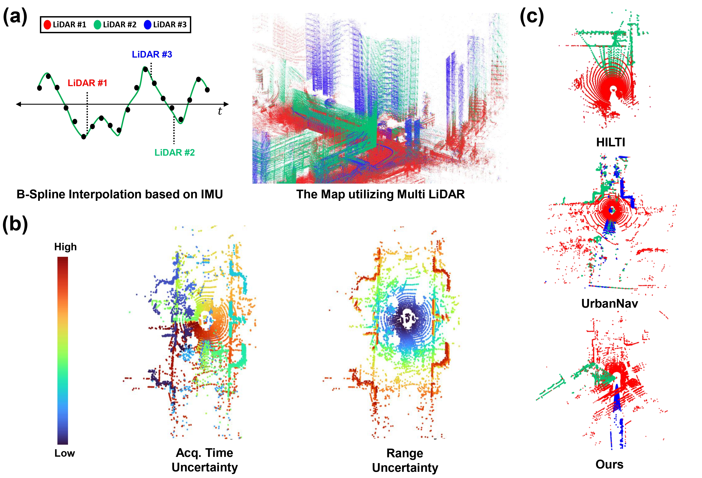
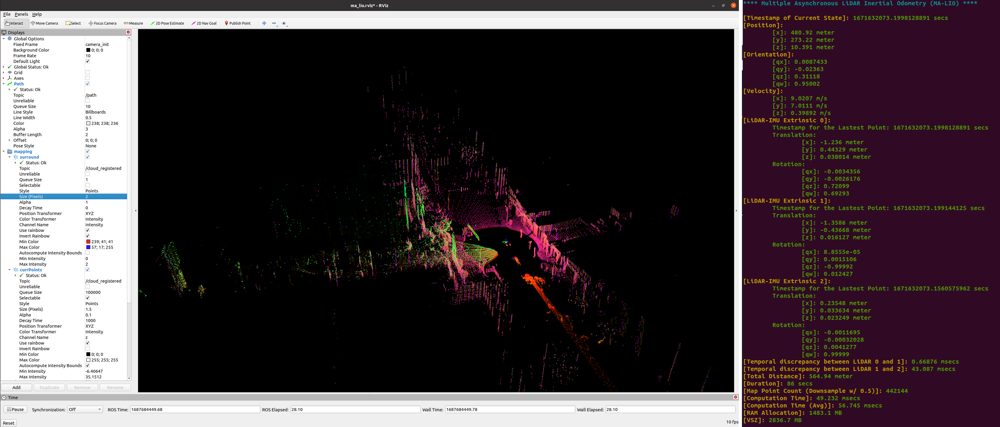
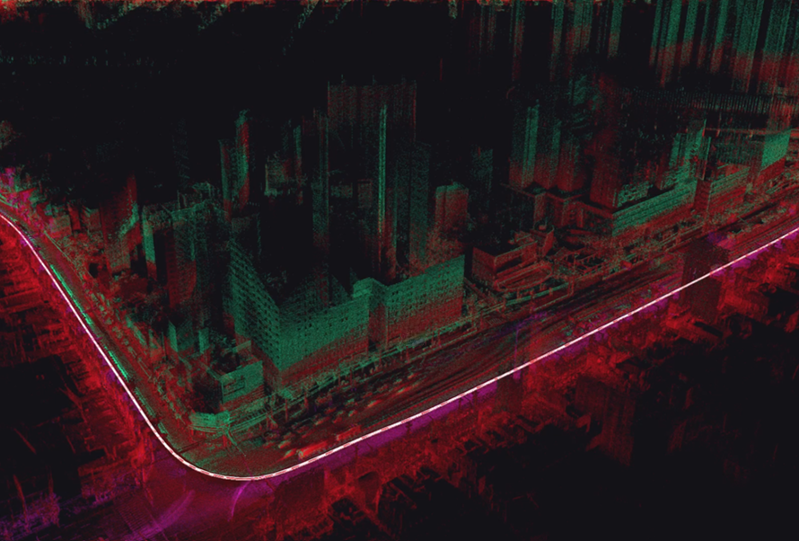
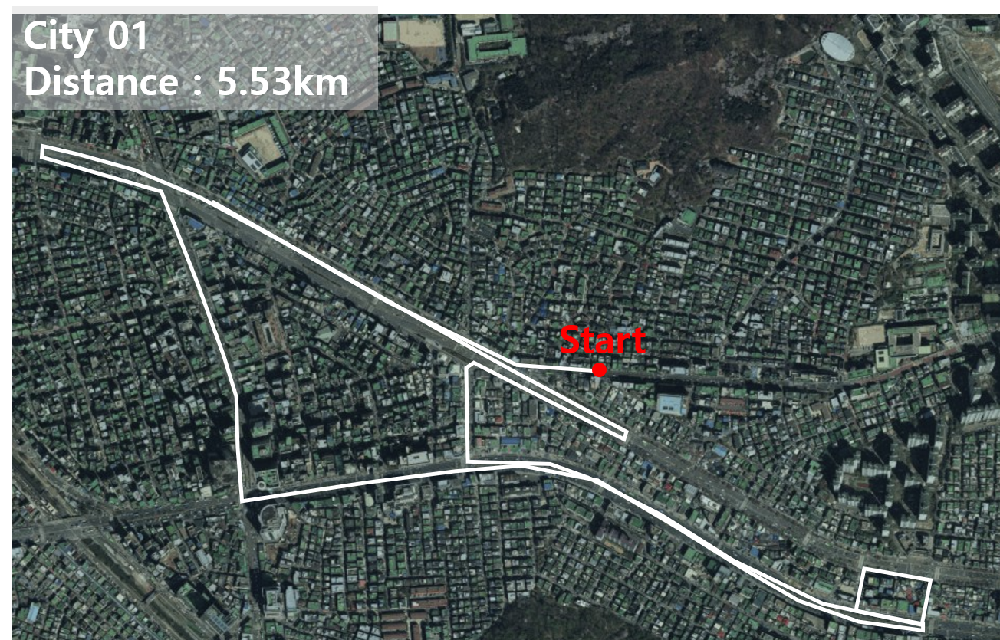
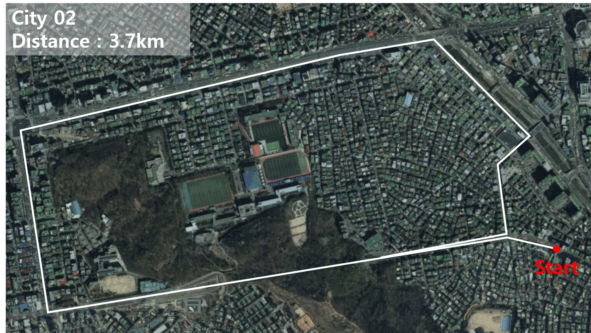
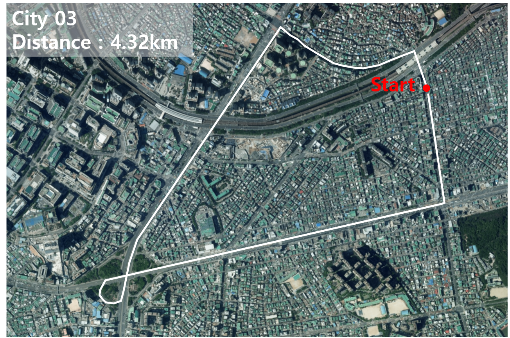

# MA-LIO (RA-L'23)

This repository, MA-LIO, contains the code for ["Asynchronous Multiple LiDAR-Inertial Odometry using Point-wise Inter-LiDAR Uncertainty Propagation"](https://ieeexplore.ieee.org/abstract/document/10138602), which is accepted by RA-L 2023. MA-LIO proposes an asynchronous multiple LiDAR-inertial odometry. To deal with the abovementioned challenges in multi-LiDAR, we model point-wise uncertainty by considering the range and state covariance at each time. Furthermore, we calculate localization weight using the surrounding environment to determine the weight term during optimization. In the video, **ours** corresponds to **the same as MA-LIO**.
<div align="left">


</div>

Find out more about our project through our [Video](https://www.youtube.com/watch?v=M-GWxY2L_Fs) or browse our paper on [IEEE](https://ieeexplore.ieee.org/abstract/document/10138602) or [Arxiv](https://arxiv.org/abs/2305.16792).

## Contributions

Our work makes the following contributions:

1. We address the Field of View (FOV) discrepancy by accurately transferring points among LiDARs, an issue that scan matching approaches failed to resolve. Using continuous time B-spline interpolation, we reduce temporal discrepancy, resulting in consistent inter-LiDAR scan alignment despite significant FOV differences.
2. The proposed point-level uncertainty captures the increased ambiguity induced by range and point acquisition time. This point-wise assessment assigns larger uncertainty for points farther in range or later in time, thereby managing uncertainty more generically.
3. We proposed a localization weight that balances the ratio between prior and measurement residual during optimization. This enables the automatic adaptation of each residual's proportion in degenerate environments, such as tunnels and narrow corridors.
4. We have validated our method on public and our own datasets. It is compatible with any combination of LiDARs with different scanning patterns from various manufacturers.

<div align="center">

<div align="left">
    
## Update

### 2023.06.25

We are delighted to release our code, MA-LIO. This is the initial release, and as such, there may be some errors or areas for improvement. **We hope it will be widely used and encourage feedback and suggestions through the issue tracker at any time**.

## 1. Prerequisites

The code is tested on:

* Linux 20.04 LTS
* ROS Noetic

### 1.1. Livox_ros_driver

To install livox_ros_driver, please follow the [Livox_ros_driver Installation](https://github.com/Livox-SDK/livox_ros_driver) guide. Before building MA-LIO and file_player for City Datasets, ensure this driver is sourced.

## 2. Build Package

To download and compile the package, use the following commands:

```bash
cd ~/catkin_ws/src
git clone https://github.com/minwoo0611/MA-LIO.git
cd ..
catkin_build
```

## 3. Launch MA-LIO

The initial codes are designed for the City Dataset with three LiDARs. To launch the MA-LIO package for a different number of LiDARs and datasets, users will need to modify five aspects of the code:

### 3.1. Create a user.yaml file

The .yaml file contains variables such as `common/lid_topic`, `common/lid_type`, `common/N_SCANS`, `common/point_filter_num`, `common/lid_num`, `mapping/extrinsic_T`, and `mapping/extrinsic_R`. User should adjust each variable to match own LiDAR specifications.

### 3.2. Sync_policies

Sync_policies from message_filters are needed to subscribe to multiple LiDAR topics. After defining the variables, initialize them with `LiDARMsgType`.

For example, the initial sync_policies look like this:

```cpp
typedef message_filters::sync_policies::ApproximateTime<LidarMsgType, LivoxMsgType, LivoxMsgType> LidarSyncPolicy;
```

The City Dataset has three LiDARs: Ouster, Livox, and Livox, hence there are three message types: `LidarMsgType`, `LivoxMsgType`, and `LivoxMsgType`. These types should be arranged to match the .yaml file. If user is using two LiDARs, for example, Velodyne and Livox, the message filters can be modified to:

```cpp
typedef message_filters::sync_policies::ApproximateTime<LidarMsgType, LivoxMsgType> LidarSyncPolicy;
```

### 3.3. Synchronizer

Following the changes in sync_policies, the synchronizer must also be adjusted accordingly. Here's how the initial code looks:

```cpp
message_filters::Synchronizer<LidarSyncPolicy> *sync =
new message_filters::Synchronizer<LidarSyncPolicy>(
    LidarSyncPolicy(10), *sub_spin[0], *sub_livox[0], *sub_livox[1]);
sync->registerCallback(boost::bind(&lidar_cbk_, _1, _2, _3));
```

If user is using two LiDARs, for instance, Velodyne and Livox, the code should be modified to:

```cpp
message_filters::Synchronizer<LidarSyncPolicy> *sync =
new message_filters::Synchronizer<LidarSyncPolicy>(
    LidarSyncPolicy(10), *sub_spin[0], *sub_livox[0]);
sync->registerCallback(boost::bind(&lidar_cbk_, _1, _2));
```

### 3.4. lidar_cbk_ function

Users will need to adjust both the input and internals of the function to suit their requirements. Here is what the initial code looks like:

```cpp
void lidar_cbk_(const sensor_msgs::PointCloud2::ConstPtr &scanMsg_,
                const livox_ros_driver::CustomMsg::ConstPtr &livoxMsg_, const livox_ros_driver::CustomMsg::ConstPtr &livoxMsg2_)
{
    standard_pcl_cbk(scanMsg_, 0);
    livox_pcl_cbk(livoxMsg_, 1);
    livox_pcl_cbk(livoxMsg2_, 2);
}
```

For instance, user can change the input like this:

```cpp
void lidar_cbk_(const sensor_msgs::PointCloud2::ConstPtr &scanMsg_,
                const livox_ros_driver::CustomMsg::ConstPtr &livoxMsg_)
```

Also, modify the internals of the function as follows:

```cpp
standard_pcl_cbk(scanMsg_, 0);
livox_pcl_cbk(livoxMsg_, 1);
```

Each inputs is correspondeing to `ros_msg` and the order of LiDAR.

### 3.5. use-ikfom

Modify the `MTK_bUILD_MANIFOLD` based on `lid_num`.

The initial manifold of the code looks like this due to the use of three lidars:

```cpp
MTK_BUILD_MANIFOLD(state_ikfom,
((vect3, pos))
((SO3, rot))
((SO3, offset_R_0))
((SO3, offset_R_1))
((SO3, offset_R_2))
((vect3, offset_T_0))
((vect3, offset_T_1))
((vect3, offset_T_2))
((vect3, vel))
((vect3, bg))
((vect3, ba))
((S2, grav))
);
```

However, if you're using two LiDARs, you can adjust it like this:

```cpp
MTK_BUILD_MANIFOLD(state_ikfom,
((vect3, pos))
((SO3, rot))
((SO3, offset_R_0))
((SO3, offset_R_1))
((vect3, offset_T_0))
((vect3, offset_T_1))
((vect3, vel))
((vect3, bg))
((vect3, ba))
((S2, grav))
);
```

After making the corresponding modifications, you can build and launch as follows:

```bash
roslaunch ma_lio mapping_user.launch
```

If the modification was successful, you can check the following RViz output:



All these steps are documented in the code. You can review the yaml file and commented code for using two LiDARs in the UrbanNav file. Following this guide will enable you to modify the code without difficulty as a SLAM engineer. Additionally, for comparison with a single LiDAR, there is a comment about running the code with a single LiDAR. You can find it easily searching the word "Especially". Also, [this issue](https://github.com/minwoo0611/MA-LIO/issues/3) helps you to run MA-LIO with single LiDAR.


## 4. Datasets
We utilize 3 datasets for the evaluation. The field of view of LiDARs in each dataset is exhibited as below.
<p align="center">
  
</p>

### 4.1. Hilti SLAM Dataset 2021
The Hilti SLAM Dataset was employed for the evaluation of MA-LIO in indoor and outdoor. This dataset comprises 200Hz IMU data, OS0-64, and Livox Horizon. To access and utilize the dataset, please follow this [link](https://hilti-challenge.com/dataset-2021.html)

### 4.2. UrbanNav Dataset
The UrbanNav Dataset was also employed for the evaluation. This dataset is composed of high-rise buildings and expansive urban environments, utilizing a 400Hz IMU and three spinning LiDAR sensors (HDL-32E, VLP 16, and LS-C16). Notably, the two 16-channel LiDAR sensors are inclined, providing an advantage in observing high-rise structures. The dataset can be found through the [link](https://github.com/IPNL-POLYU/UrbanNavDataset). However, as each time of point from LS-C16 LiDAR has the time from 0 to 20ms, we recommend users using two LiDARs without LS-C16 for MA-LIO.

### 4.3. City Datasets
<p align="center">
  
</p>
The City Datasets were utilized for the evaluation and ablation study of MA-LIO. This dataset was collected in urban environments using a car, exhibiting high velocity, dynamic objects, numerous rotations with U-turns, and tunnels. The dataset was acquired using three LiDAR sensors (Livox Avia, Livox Tele, and OS2-128) and a 100Hz IMU. The ground truth data was obtained using the SPAN CPT-7 system. 

In the datasets, we provide Livox Avia, Tele, and Ouster point files (.bin) containing full values (x, y, z, intensity, time, etc.) from their original point cloud data. The bin file names correspond to their timestamps. Additionally, the data_stamp.csv and ouster_stamp.csv files display the timestamps of our measurements, while the Groundtruth.txt file presents the ground truth trajectory with the format (timestamp, x, y, z, qx, qy, qz, qw). The xsens_imu.csv file contains IMU measurements.

By using the provided file player, users can transform the .bin files and .csv files into ROS messages. In the case of Ouster data, the files are converted to sensor_msgs::PointCloud2 format, while for Livox data, they are transformed into livox_ros_driver::CustomMsg format. Finally, the IMU data is presented as sensor_msgs::Imu.

Users can download city dataset using the link. We exhibit and describe the each sequence in the city dataset as below.
Furthermore, the extrinsic transformation between the IMU and LiDAR sensors can be verified through [Extrinsic.txt](https://github.com/minwoo0611/MA-LIO/blob/main/Extrinsic.txt)
#### 4.3.1. City01 sequence
<p align="center">
  
</p>

[City01](https://drive.google.com/file/d/14deGbiJAUO1Mlme5Gj9_0mJLc9jdWTmK/view?usp=share_link) (28.52GB, 1309sec) : This sequence features many rotations and u-turns, causing localization failure. Furthremore, it is the longest sequence of city datasets.

#### 4.3.2. City02 sequence
<p align="center">
  
</p>

[City02](https://drive.google.com/file/d/1388NocNL0qsRsh2Yewj8lFWMSSsl6_Ia/view?usp=share_link) (14.34GB, 624sec) : City02 contains a 400m long tunnel environment, where failure to establish correspondences between points leads to significant errors in estimating forward motion.

#### 4.3.3. City03 sequence
<p align="center">
  
</p>

[City03](https://drive.google.com/file/d/1MxNr93KTBZ0Vcf95nDsvWTPCaz2LRVJS/view?usp=sharing) (19.78GB, 688sec) : City03 spans over 4.3km with numerous dynamic objects and no loops until the return to the start point, resulting in a large accumulated error. 

To utilize the dataset, please follow these instructions:
```
source devel/setup.bash
roslaunch file_player file_player.launch
```
- Click the "Load" button and navigate to the "City0x" folder.
- Select the "Open" button, followed by the "Play" button.

Upon completion of these steps, users can now verify the publication of ROS messages.

## 5. Acknowledgments

Thanks for [Fast-LIO2](https://github.com/hku-mars/FAST_LIO), [OpenVINS](https://github.com/rpng/open_vins), [M-LOAM](https://github.com/gogojjh/M-LOAM) and [file_player](https://github.com/irapkaist/file_player). Furtheremore, Thank [lnexenl](https://github.com/lnexenl) for maintaining the code and continuous pull request.

## Citation
If you use our code or dataset in yorr work, please consider citing the following:
```bash
@article{jung2023asynchronous,
  title={Asynchronous Multiple LiDAR-Inertial Odometry using Point-wise Inter-LiDAR Uncertainty Propagation},
  author={Jung, Minwoo and Jung, Sangwoo and Kim, Ayoung},
  journal={IEEE Robotics and Automation Letters},
  year={2023},
  publisher={IEEE}
}
```

